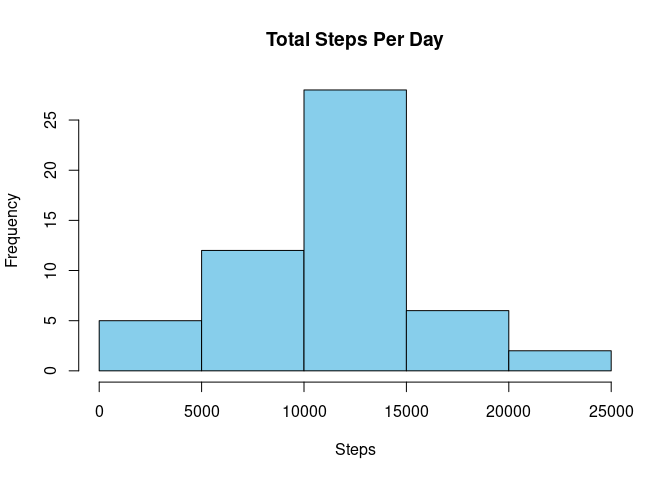
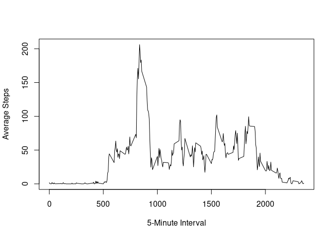
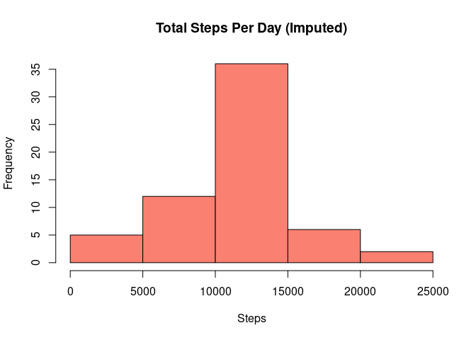
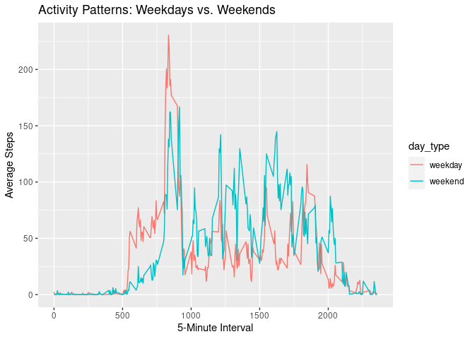

For this assignment, we will be analyzing activity data for an anonymous individual, based on step counts collected at 5 minute intervals throughout the day, for October and November of 2012. 

First, we'll unzip and read in the data file, removing missing values in the data.


```r
unzip("activity.zip", exdir = "RepData_PeerAssessment1")
activity_data <- read.csv("RepData_PeerAssessment1/activity.csv")
activity_no_na <- na.omit(activity_data)
```

Next, we'll calculate the total steps taken per day, as well as the mean and median, illustrated by the histogram below.


```r
total_steps_per_day <- aggregate(steps ~ date, data = activity_no_na, sum)
total_steps_per_day
```

```
##          date steps
## 1  2012-10-02   126
## 2  2012-10-03 11352
## 3  2012-10-04 12116
## 4  2012-10-05 13294
## 5  2012-10-06 15420
## 6  2012-10-07 11015
## 7  2012-10-09 12811
## 8  2012-10-10  9900
## 9  2012-10-11 10304
## 10 2012-10-12 17382
## 11 2012-10-13 12426
## 12 2012-10-14 15098
## 13 2012-10-15 10139
## 14 2012-10-16 15084
## 15 2012-10-17 13452
## 16 2012-10-18 10056
## 17 2012-10-19 11829
## 18 2012-10-20 10395
## 19 2012-10-21  8821
## 20 2012-10-22 13460
## 21 2012-10-23  8918
## 22 2012-10-24  8355
## 23 2012-10-25  2492
## 24 2012-10-26  6778
## 25 2012-10-27 10119
## 26 2012-10-28 11458
## 27 2012-10-29  5018
## 28 2012-10-30  9819
## 29 2012-10-31 15414
## 30 2012-11-02 10600
## 31 2012-11-03 10571
## 32 2012-11-05 10439
## 33 2012-11-06  8334
## 34 2012-11-07 12883
## 35 2012-11-08  3219
## 36 2012-11-11 12608
## 37 2012-11-12 10765
## 38 2012-11-13  7336
## 39 2012-11-15    41
## 40 2012-11-16  5441
## 41 2012-11-17 14339
## 42 2012-11-18 15110
## 43 2012-11-19  8841
## 44 2012-11-20  4472
## 45 2012-11-21 12787
## 46 2012-11-22 20427
## 47 2012-11-23 21194
## 48 2012-11-24 14478
## 49 2012-11-25 11834
## 50 2012-11-26 11162
## 51 2012-11-27 13646
## 52 2012-11-28 10183
## 53 2012-11-29  7047
```

```r
mean_steps_per_day <- mean(total_steps_per_day$steps)
mean_steps_per_day
```

```
## [1] 10766.19
```

```r
median_steps_per_day <- median(total_steps_per_day$steps)
median_steps_per_day
```

```
## [1] 10765
```

```r
hist(total_steps_per_day$steps, main = "Total Steps Per Day", xlab = "Steps", col = "skyblue")
```

<!-- -->

We see that the mean of the total steps taken per day is 10766.19.
Now, we'll look at a time series plot of the average daily pattern to find which interval, on average, contains the max number of steps.


```r
avg_steps_per_interval <- aggregate(steps ~ interval, data = activity_no_na, mean)

plot(avg_steps_per_interval$interval, avg_steps_per_interval$steps, type = "l",
     xlab = "5-Minute Interval", ylab = "Average Steps")
```

<!-- -->

```r
max_interval <- avg_steps_per_interval$interval[which.max(avg_steps_per_interval$steps)]
max_interval
```

```
## [1] 835
```

Looks like the max interval is 835.  To understand what impact our null values have on our averages, we'll count how many we have,  fill each  missing value with the mean for the corresponding interval, and create a histogram of the total steps per day with the estimated values.


```r
total_missing_values <- sum(is.na(activity_data))
total_missing_values
```

```
## [1] 2304
```

```r
activity_imputed <- activity_data
activity_imputed$steps[is.na(activity_imputed$steps)] <- avg_steps_per_interval$steps

total_steps_per_day_imputed <- aggregate(steps ~ date, data = activity_imputed, sum)

mean_steps_per_day_imputed <- mean(total_steps_per_day_imputed$steps)
mean_steps_per_day_imputed
```

```
## [1] 10766.19
```

```r
median_steps_per_day_imputed <- median(total_steps_per_day_imputed$steps)
median_steps_per_day_imputed
```

```
## [1] 10766.19
```

```r
hist(total_steps_per_day_imputed$steps, main = "Total Steps Per Day (Imputed)",
     xlab = "Steps", col = "salmon")
```

<!-- -->

We seem to be missing 2,304 counts.  Using our estimated values, both our mean and median steps per day are the same as our original mean; 10766.19. This does not seem to have impacted the data.

Finally, we'll take a look at the activity patterns between weekdays and weekends, using the plot below. 


```r
activity_imputed$day_type <- ifelse(weekdays(as.Date(activity_imputed$date)) %in% c("Saturday", "Sunday"), "weekend", "weekday")

avg_steps_by_day_type <- aggregate(steps ~ interval + day_type, data = activity_imputed, mean)

library(ggplot2)
ggplot(avg_steps_by_day_type, aes(x = interval, y = steps, color = day_type)) +
  geom_line() +
  labs(x = "5-Minute Interval", y = "Average Steps", title = "Activity Patterns: Weekdays vs. Weekends")
```

<!-- -->
We can see that weekdays seem to have more activity first thing in the morning, but weekends have greater sustained activity throughout the day. 


